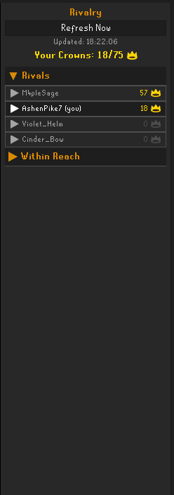
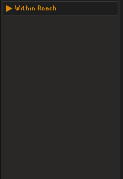
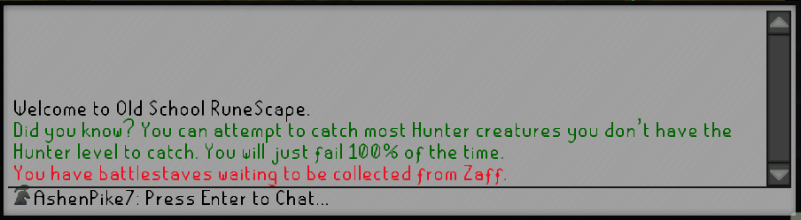
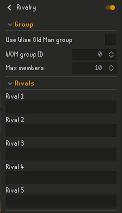
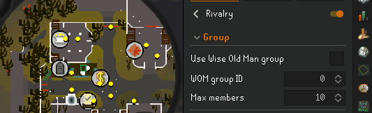

<h1 align="center">
  
  RIVALRY
  
</h1>

Turn the hiscores into a competition.

Rivalry tracks you and your chosen rivals across Old School RuneScape hiscore
categories, awards crowns to the leaders, and shows who is ahead, who is
catching up, and which crowns are closest for you to steal next.

Whether you are racing friends, comparing clanmates, or just want a little more
motivation to send one more boss trip, Rivalry turns passive hiscore numbers into
a live scoreboard.

## Why Use Rivalry?

OSRS progress is more fun when there is someone to chase.

Rivalry gives every tracked category a crown. If you have the most Attack XP, you
hold the Attack crown. If your friend has the most Vorkath KC, they hold the
Vorkath crown. The panel rolls those crowns into a simple leaderboard so you can
see who is winning overall, then lets you drill into the details.

Instead of asking "who has better stats?", Rivalry answers better questions:

Which crowns do I currently hold? 
Which rival is beating me overall? 
What are they beating me in? 
Which crowns am I closest to taking? 
Did someone just overtake me?

## Features

<strong>Crown leaderboard:</strong> players are ranked by how many category crowns they currently hold.  
<strong>Crowns across the hiscores:</strong> track skills, bosses, clue scrolls, minigames, and other hiscore activities.  
<strong>Aggregate crowns:</strong> compete for Total Level and Total Boss KC in addition to individual categories.  
<strong>Detailed breakdowns:</strong> expand any player to see Skills, Bosses, and Other tabs with category-by-category gaps.  
<strong>Within Reach:</strong> see the crowns you do not hold yet, sorted by the smallest gap first.

<strong>Skill XP mode:</strong> for skills, compare by visible level or by XP so level-99 rivalries still matter.  
<strong>Crown notifications:</strong> get notified when you claim a crown or lose one.

<strong>Manual rivals:</strong> enter up to five usernames directly.  
<strong>Wise Old Man groups:</strong> optionally populate rivals from a Wise Old Man group and track the most recently active members.

## How It Works

Add rivals manually or connect a Wise Old Man group. Rivalry fetches normal
account hiscores from the official OSRS hiscores, compares every tracked player,
and awards each crown to the single player who leads that category.

Tied categories are contested, so nobody gets the crown until someone pulls
ahead.

For skills, crowns are awarded by XP, not just level. That means two players can
both be level 99, but the player with more XP still holds the crown. Bosses and
activities use their hiscore score, kill count, or completion count.

## The Panel

The side panel is built for quick checks:

<strong>Your Crowns</strong> shows how many crowns you hold out of all crowns currently in play.  
<strong>Rivals</strong> ranks everyone by crown count.  
<strong>Expanded player rows</strong> show category gaps with compact icons and color-coded numbers.  
<strong>Within Reach</strong> highlights your closest targets so you can decide what to do next.

## Setup

<strong>1.</strong> Install <strong>Rivalry</strong> from the RuneLite Plugin Hub. 
<strong>2.</strong> Enable the plugin. 
<strong>3.</strong> Open the Rivalry panel from the crown icon in the side toolbar. 
<strong>4.</strong> Add rivals manually, or enable Wise Old Man group mode in the plugin settings. 
<strong>5.</strong> Click <strong>Refresh Now</strong> or let the plugin refresh on its polling interval.

### Manual Rivals

Use the **Rivals** settings to enter up to five OSRS usernames.

### Wise Old Man Group

If your friends or clan already use Wise Old Man, Rivalry can populate the rival
list from a group:

<strong>1.</strong> Enable <strong>Use Wise Old Man group</strong>. 
<strong>2.</strong> Enter the numeric group ID from <code>wiseoldman.net/groups/&lt;id&gt;</code>. 
<strong>3.</strong> Choose how many recently active members to track.

This option contacts Wise Old Man, a third-party service, to read group
membership. It is disabled by default and must be enabled manually.

## Settings At A Glance

| Section | Setting | What it does |
|---|---|---|
| Group | Use Wise Old Man group | Use a WOM group instead of manual rivals |
| Group | WOM group ID | Selects the group to read |
| Group | Max members | Limits how many recently active group members are tracked |
| Rivals | Rival 1-5 | Manual usernames |
| Crown Categories | Track Skills / Bosses / Activities | Chooses which hiscore categories award crowns |
| Display | Gap to next player | Compares you to the next player above you instead of only the crown holder |
| Polling | Poll interval | Controls automatic hiscore refresh timing |
| Notifications | Crown notification | Controls how crown gain/loss alerts are delivered |

## Notes

Hiscores update when players log out, so very recent progress may not appear immediately.  
Rivalry uses the normal OSRS hiscores.  
Only players who appear on the normal hiscores can be tracked.  
Wise Old Man is used only to find group members. Hiscore comparison still uses the official OSRS hiscores.

## Maintainers

Technical documentation lives in [docs/](docs/OVERVIEW.md).
Release notes live in [CHANGELOG.md](CHANGELOG.md).

## License

BSD 2-Clause. See [LICENSE](LICENSE).

